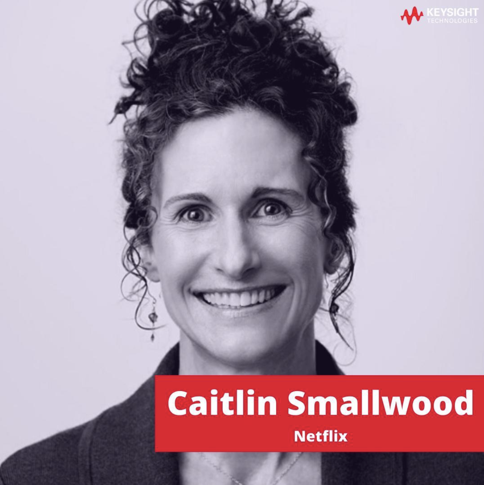

  
# Proyecto liderado y ejecutado por un científico de datos

**Caitlin Smallwood**

*Vicepresidenta de Ciencia y Algoritmos (VP of Science and Algorithms) en Netflix*

Fue la responsable de liderar un gran cambio en la masiva plataforma de netflix que cambiaría la empresa de buena manera. Caitlyn se encargo de implementar la ciencia de datos en todo su esplendor para mejorar los números de netflix, una tarea grandísima y retadora para cualquier científico de datos. Demostrando una gran destreza, Caitlyn y su equipo pudieron lograr satisfactoriamente su meta, optimizaron Netflix como lo conocemos hoy en día. 

Este grupo de personas logro este gran trabajo mediante varios modelos predictivos y algoritmos de análisis de datos, los cuales siendo alimentados por las gigantes bases de datos de netflix, pudieron mostrar al mundo lo efectiva que puede ser la ciencia de datos.

### Cómo Netflix utiliza los datos y el análisis

  
Motor de recomendaciones personalizadas

  Caitlyn logro implementar exitosamente modelos de machine learning en la plataforma de netflix, con el fin de mejorar su sistema de recomendaciones, sistema el cual estaba un tanto obsoleto debido a su falta de eficacia basada en el rating del usuario al producto que esta viendo el cliente al momento. 

  Esto supuso una mejoría indiscutible en las recomendaciones de la plataforma, una muestra de esto es el aumento de la retención del usuario en las peliculas/series mostradas

  

  
Análisis del desarrollo de contenido

  Netflix utiliza un modelo de proyección para garantizar que el proyecto encargado o renovado se ajuste a ciertos parámetros . En otras palabras, analiza el rendimiento de programas similares en el pasado.

  

  
Obra de arte personalizada

    En lo que respecta a las imágenes que Netflix utiliza para atraer espectadores, se trata de una combinación de ambas. Mediante el Análisis Visual de Obras de Arte (AVA, por sus siglas en inglés) , «un conjunto de herramientas y algoritmos diseñados para extraer imágenes de alta calidad de los vídeos», se puede predecir qué material publicitario tendrá mayor impacto en cada usuario según su edad y preferencias generales. 

  

  
Optimización de operaciones

  Netflix utiliza análisis de datos para optimizar todo, desde la experiencia del usuario en la aplicación hasta la logística de los rodajes. Por ejemplo, han desarrollado algoritmos para predecir el coste estimado de filmar en una ubicación en comparación con otra. También utilizan análisis de datos para aumentar la eficiencia de las actividades de rodaje y posproducción, como la edición, reduciendo los cuellos de botella y optimizando los flujos de trabajo.

  

### A continuacion una tabla comparativa para tener una mejor idea del trabajo hecho por caitlyn:

|**Netflix**|**Otras plataformas**|
|-----------|---------------------|
|Utiliza microdatos que deja el usuario para mayor personalizacion|Se basa en lo que es mas popular al momento|
|Al crear una cuenta, le pide al usuario elegir 3 títulos para que se adecue a sus gustos|Muestra directamente los mayores éxitos del catalogo|
|Modifica las portadas de las películas según los gustos del usuario, logrando que llamen mas la atencion|Muestran el póster oficial del cine, en resumen, todos ven la misma portada|

>https://www.kdd.org/kdd2016/speakers/view/caitlin-smallwood#:~:text=*%20Computational%20Social%20Science%3A%20Exciting%20Progress%20and,timing%20%2D%20impact%20Netflix's%20data%20science%20applications.

>Gutierrez, S. (2014). Data scientists at work. Apress. https://doi.org/10.1007/978-1-4302-6599-3

>Mixson, E. (2025, 19 de marzo). Data science at Netflix: How advanced data & analytics helps Netflix generate billions. AI, Data & Analytics Network. https://www.aidataanalytics-network.com/data-science-ai/articles/data-science-at-netflix-how-advanced-data-analytics-helped-netflix-generate-billions

